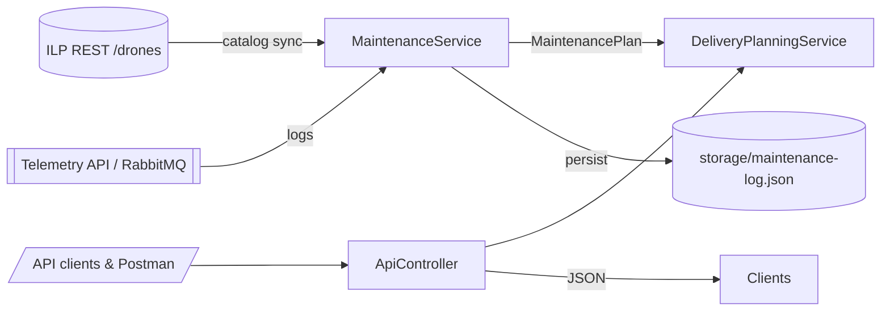

# CW3 Build & Run Notes

## Prerequisites

- JDK 21+
- Maven 3.9+
- (Optional) Docker if you want to ship the Spring Boot image

## Build

```bash
mvn clean package
```

Outputs `target/CW1-0.0.1-SNAPSHOT.jar`.

## Run locally

```bash
mvn spring-boot:run
# or
java -jar target/CW1-0.0.1-SNAPSHOT.jar
```

The service exposes `http://localhost:8080/api/v1`.
Set `ILP_ENDPOINT` to override the default ILP data source.

## CW3 Add-on - Maintenance Intelligence Kit

CW3 introduces a predictive maintenance layer that stores telemetry in `storage/maintenance-log.json` and produces risk-aware plans for every drone in the ILP catalogue. Highlights:

- `POST /api/v1/maintenance/log` - Persist a maintenance/telemetry event and immediately get a refreshed plan for that drone. Includes request validation and automatic high-risk alert logging.
- `POST /api/v1/maintenance/plan` - Batch planning endpoint. Accepts optional `droneIds` and `newLogs` (see `MaintenancePlanRequest`) and returns per-drone plans plus fleet insight.
- `GET /api/v1/maintenance/summary` - Quick fleet snapshot, ideal for dashboards.
- `GET /api/v1/maintenance/{droneId}` - Get maintenance snapshot for a specific drone.
- `GET /api/v1/maintenance/export/json` - Export all maintenance data as JSON.
- `GET /api/v1/maintenance/export/csv` - Export all maintenance data as CSV for analysis.

Sample payload:

```json
POST /api/v1/maintenance/log
{
  "droneId": "drn-001",
  "flightHours": 11.3,
  "missions": 9,
  "emergencyDiversions": 1,
  "avgPayloadKg": 18.2,
  "batteryHealth": 0.78,
  "temperatureAlerts": true,
  "communicationIssues": false,
  "note": "Cooling loop ran hot near Fort William"
}
```

Responses include:

- `riskScore` (0-100)
- `riskLevel` (`LOW/MEDIUM/HIGH`)
- `hoursUntilService`, `missionBuffer`
- Human-readable `recommendation` and `contributingFactors`
- Optional `insight` block with fleet readiness trends

## Request Validation & Error Handling

The API includes comprehensive validation:
- `droneId` is required and cannot be blank
- Numeric fields (`flightHours`, `missions`, etc.) must be non-negative
- `batteryHealth` must be between 0 and 1
- Invalid requests return structured error responses with field-level validation messages

Example error response:
```json
{
  "timestamp": "2025-11-19T04:45:00Z",
  "status": 400,
  "error": "Validation Failed",
  "fieldErrors": {
    "droneId": "droneId is required",
    "batteryHealth": "batteryHealth must be between 0 and 1"
  }
}
```

## High-Risk Alert Mechanism

When a drone's risk level becomes HIGH (score >= 70), the system automatically logs an alert to the console:
```
[HIGH RISK ALERT] Drone drn-101: Risk Score 75.8/100, Hours Until Service: 4.2, Recommendation: Ground immediately and schedule engineering review.
  Contributing Factors: Sustained utilization above 75%, Multiple emergency diversions logged
```

Alerts are triggered when:
- Recording a new maintenance log via `/maintenance/log`
- Running batch planning via `/maintenance/plan`

## Data Export

Export maintenance data for analysis or reporting:
- `GET /api/v1/maintenance/export/json` - Returns JSON format with all plans and insights
- `GET /api/v1/maintenance/export/csv` - Returns CSV format with columns: droneId, riskLevel, riskScore, hoursUntilService, missionBuffer, recommendation, contributingFactors

## Extending or Resetting Data

The maintenance store lives in `storage/maintenance-log.json`. Delete the file to wipe captured telemetry. The service recreates it automatically.

### Telemetry simulator

- Controlled via `maintenance.simulator.enabled` (default `true`) and `maintenance.simulator.interval-ms` (default `60000`).
- When enabled, `MaintenanceTelemetrySimulator` periodically synthesises maintenance logs for a subset of ILP drones, showing how the risk model behaves with streaming data.
- Disable the simulator for production demos by setting `maintenance.simulator.enabled=false`.

## Architecture Overview



- `MaintenanceService` merges ILP catalogue data with persisted telemetry to compute risk scores and exposes snapshots to any caller.
- `DeliveryPlanningService` consults those snapshots while choosing a drone, so dispatching avoids high-risk airframes by default.
- Additional adapters (RabbitMQ, MCP, dashboards) can push or consume data via the same REST surface without new business logic.

## MCP (Model Context Protocol) Integration

The maintenance API is exposed as MCP tools, allowing LLMs to query drone maintenance status directly.

### Setup

1. Install Python dependencies:
```bash
cd mcp-server
pip install -r requirements.txt
```

2. Ensure the Spring Boot service is running on `http://localhost:8080` (or set `ILP_MAINTENANCE_API_URL` environment variable).

3. Configure your MCP client (e.g., Claude Desktop, Cursor) to use the server:
```json
{
  "mcpServers": {
    "ilp-maintenance": {
      "command": "python",
      "args": ["mcp-server/maintenance_mcp_server.py"]
    }
  }
}
```

### Available MCP Tools

- `get_fleet_summary` - Get overall fleet maintenance status and readiness
- `get_drone_maintenance` - Get detailed plan for a specific drone
- `get_high_risk_drones` - List all drones requiring immediate attention
- `log_maintenance_event` - Record telemetry/maintenance data
- `plan_maintenance_batch` - Batch query multiple drones

### Example LLM Usage

Once configured, you can ask your LLM:
- "What's the maintenance status of drone drn-101?"
- "Show me all high-risk drones"
- "What's the overall fleet readiness?"
- "Log a maintenance event: drone drn-101, 15 flight hours, battery health 0.75"

The LLM will automatically call the appropriate MCP tools to answer your questions.

## Generating Submission Artefacts

- Code/JAR: use `mvn package`
- Report: see `cw3_explanation.pdf` (generated via `python scripts/generate_cw3_pdf.py` or by running the provided command in the README section below).
